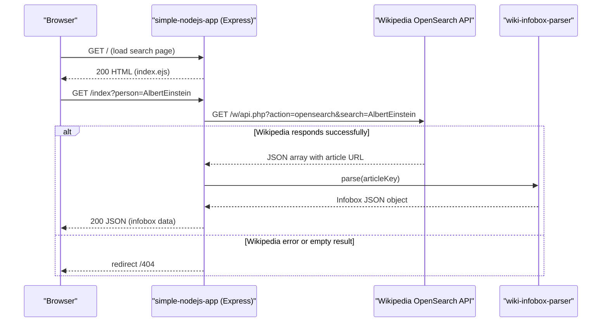

# API & Service Communication Contracts

The application exposes 2 HTTP endpoints via a single Express server, with all communication to external services (Wikipedia) performed synchronously over HTTP.

## Service Catalog

| Service | Port | Category | Purpose |
|---------|------|----------|---------|
| simple-nodejs-app | 3000 | Business | Serves the search UI and returns Wikipedia infobox data for a given person |

## API Endpoints Inventory

| Service | Method | Path | Request Type | Response Type |
|---------|--------|------|-------------|---------------|
| simple-nodejs-app | GET | `/` | None | HTML (index.ejs rendered page) |
| simple-nodejs-app | GET | `/index` | Query param: `person` (string) | JSON (Wikipedia infobox object) or redirect to `/404` on error |

## Management & Observability Endpoints

| Service | Endpoint | Custom Metrics |
|---------|----------|---------------|
| simple-nodejs-app | None configured | None |

No health check, readiness probe, metrics, or admin endpoints are implemented.

## DTOs & Contracts

There are no formal DTO or contract classes. The application uses two implicit data shapes:

- **Wikipedia OpenSearch response** (inbound from Wikipedia API): a JSON array `[searchTerm, [titles], [descriptions], [urls]]`; the application extracts `result[3][0]` (the article URL) and derives a key by stripping the first 30 characters.
- **Wikipedia Infobox response** (inbound via `wiki-infobox-parser`): a raw JSON object whose structure varies by article; this object is forwarded directly to the client without transformation or schema validation.

No OpenAPI/Swagger specification, protobuf schemas, or GraphQL schemas are present. No serialization configuration is defined; Express's default `res.send()` serialises plain objects to JSON.

## Communication Patterns

**Synchronous REST (outbound only):**  
All external calls are synchronous HTTP GET requests to the Wikipedia API. The `request` library makes a call to `https://en.wikipedia.org/w/api.php` for the opensearch, then `wiki-infobox-parser` makes a follow-up call to retrieve the infobox. These calls are chained via callbacks (no Promise or async/await).

**No asynchronous messaging**, message queues, pub/sub, gRPC, or event-driven patterns are present.

**Resilience:** No circuit breaker, retry logic, timeout configuration, or bulkhead patterns are implemented. If the Wikipedia API is unavailable or returns unexpected data, the error handler redirects to `/404` — there is no graceful degradation or fallback.

**Service discovery:** Not applicable — only a single service with a hardcoded external URL.

**Security posture:** No authentication, authorisation, or TLS configuration is present. All endpoints are publicly accessible with no authorisation checks. The application does not use HTTPS, JWT, OAuth2, or any session/cookie-based security. The Docker entrypoint does not configure TLS termination.

## Service Technology Matrix

| Service | Web Framework | Data Access | Discovery | Gateway | Health Check | Cache | Metrics |
|---------|--------------|------------|-----------|---------|-------------|-------|---------|
| simple-nodejs-app | Express 4 + EJS | None (external API only) | None | None | None | None | None |

## Service Communication Sequence

