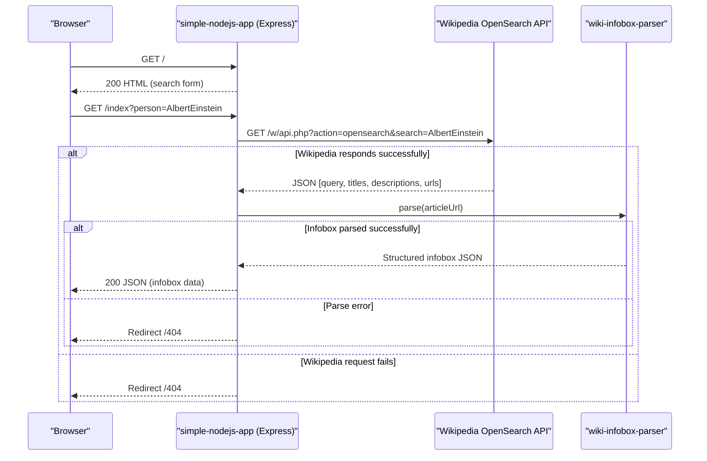

# API & Service Communication Contracts

The application exposes **2 HTTP endpoints** via a single Express server and communicates synchronously with the external Wikipedia API to fulfil search requests.

## Service Catalog

| Service | Port | Category | Purpose |
|---------|------|----------|---------|
| simple-nodejs-app | 3000 | Business | Serves a search form and proxies Wikipedia person-research queries to the client |

## API Endpoints Inventory

| Service | Method | Path | Request Type | Response Type |
|---------|--------|------|-------------|---------------|
| simple-nodejs-app | GET | `/` | None | HTML page (index.ejs rendered view) |
| simple-nodejs-app | GET | `/index` | Query param: `person` (string) | JSON (Wikipedia infobox object) or redirect to `/404` |

## Management & Observability Endpoints

| Service | Endpoint | Custom Metrics |
|---------|----------|---------------|
| simple-nodejs-app | None configured | None |

No health check, readiness probe, metrics, or Swagger/OpenAPI endpoint is defined.

## DTOs & Contracts

No formal DTO classes are defined. The application:

- **Inbound contract**: A single query parameter `person` (string) on `GET /index`. No request body or schema validation is applied.
- **Outbound contract**: The response is the raw JSON object returned by `wiki-infobox-parser`, whose structure is determined by the upstream Wikipedia infobox content and is not formally typed or documented.
- **No OpenAPI/Swagger spec** is present.
- **No protobuf or GraphQL schema** is used.
- Serialization is handled implicitly by Express's `res.send()` with no custom serializer configured.

## Communication Patterns

**Synchronous (outbound only)**: The application makes two chained synchronous HTTP calls using the deprecated `request` library:

1. `GET https://en.wikipedia.org/w/api.php?action=opensearch&search={person}&limit=1&namespace=0&format=json` — resolves the Wikipedia article URL for the queried person.
2. `wiki-infobox-parser` internally fetches and parses the Wikipedia article's infobox data.

**No asynchronous messaging** (Kafka, RabbitMQ, etc.) is used.

**Resilience**: There are no retry policies, circuit breakers, or timeout configurations. A failed outbound call results in a client redirect to `/404` with no retries and no fallback content.

**Service discovery**: Not applicable — the Wikipedia API URL is hardcoded as a string literal in `index.js`.

**API gateway**: Not applicable — the application is a standalone single-process server.

**Security posture**: No authentication, authorization, or TLS is configured. All endpoints are publicly accessible with no authorization checks. The application listens on port 3000 over plain HTTP. There is no use of HTTPS, JWT, OAuth2, API keys, or any session management.

## Service Technology Matrix

| Service | Web Framework | Data Access | Discovery | Gateway | Health Check | Cache | Metrics |
|---------|--------------|-------------|-----------|---------|-------------|-------|---------|
| simple-nodejs-app | Express 4 + EJS | None (external HTTP) | None | None | None | None | None |

## Service Communication Sequence

