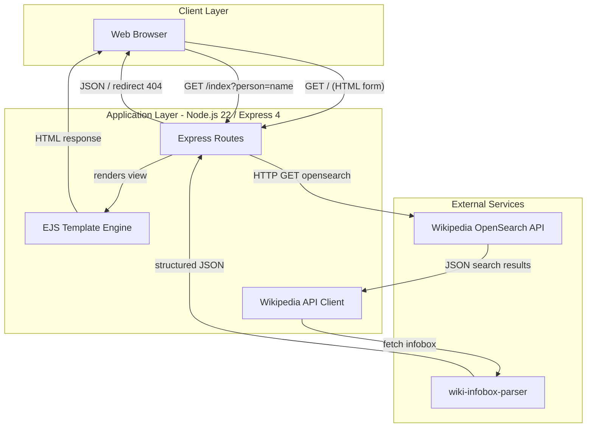
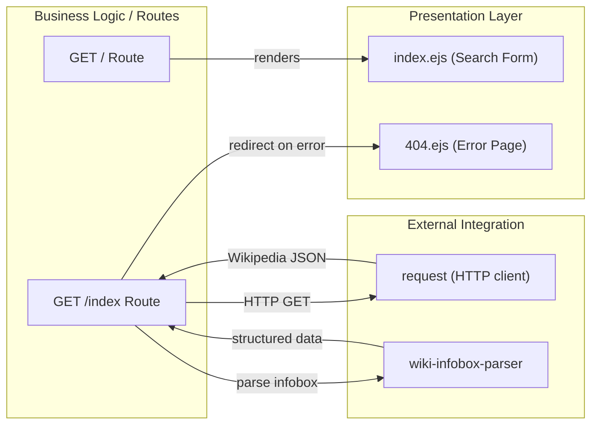

# Architecture Diagram

This document describes the high-level application architecture and detailed component relationships of the **simple-nodejs-app**, a Wikipedia person-research web application built on Node.js and Express.

## Application Architecture

### Technology Stack Summary

| Layer | Technology | Version | Purpose |
|-------|-----------|---------|---------|
| Presentation | EJS | ^3.1.10 | Server-side HTML templating |
| Web Framework | Express | ^4.17.3 | HTTP routing and middleware |
| HTTP Client | request | ^2.88.2 | Outbound HTTP calls to Wikipedia |
| Data Parsing | wiki-infobox-parser | ^0.1.11 | Parse Wikipedia infobox JSON |
| Runtime | Node.js | 22.x | JavaScript server runtime |
| Container | Docker | latest node image | Application packaging |
| Dev Tooling | nodemon | ^2.0.20 | Auto-restart during development |

### Data Storage & External Services

The application has no local data storage. All data originates from the **Wikipedia OpenSearch API** (`https://en.wikipedia.org/w/api.php`). On each search request, the app queries Wikipedia for the person's name, extracts the Wikipedia article URL from the response, and passes it to `wiki-infobox-parser` to fetch and structure the article's infobox data, which is returned as JSON directly to the browser. There is no database, cache, or session store.

### Key Architectural Decisions

- **Stateless single-file server**: All routing logic is contained in `index.js`, keeping the codebase minimal and easy to follow.
- **EJS for server-side rendering**: The search form is rendered server-side; search results are returned as raw JSON to the client rather than being embedded in a template.
- **Direct Wikipedia API integration**: The app delegates all data retrieval and parsing to the Wikipedia API and `wiki-infobox-parser`, avoiding any local data management complexity.

## Component Relationships

### Component Inventory

| Component | Layer | Type | Responsibility |
|-----------|-------|------|---------------|
| `index.js` | Business Logic | Express App | Bootstrap Express, register routes, start HTTP server |
| `GET /` Route | Presentation | Express Route | Render the search form homepage |
| `GET /index` Route | Business Logic | Express Route | Accept person query, call Wikipedia API, return JSON or redirect to 404 |
| `index.ejs` | Presentation | EJS Template | HTML search form presented to the user |
| `404.ejs` | Presentation | EJS Template | Error page shown when search fails |
| `request` | Integration | HTTP Client | Performs outbound GET requests to the Wikipedia OpenSearch API |
| `wiki-infobox-parser` | Integration | Library | Parses Wikipedia infobox data from an article URL into structured JSON |
