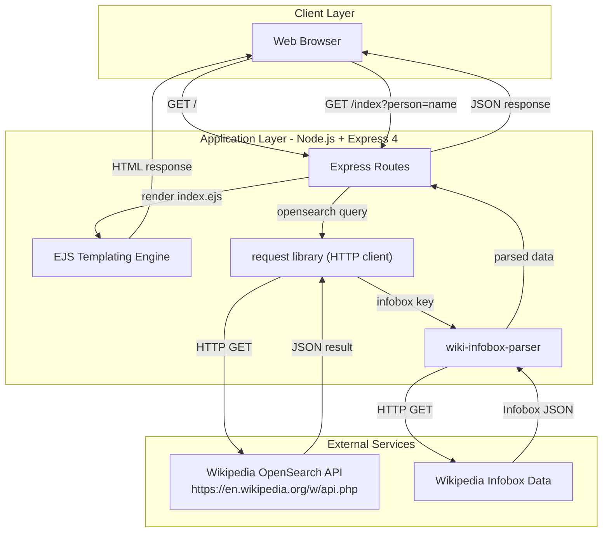
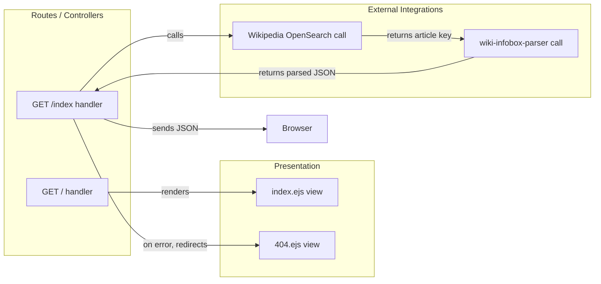

# Architecture Diagram

This document describes the architecture of the `simple-nodejs-app`, a Node.js/Express web application that retrieves and displays Wikipedia infobox data for a given person.

## Application Architecture

### Technology Stack Summary

| Layer | Technology | Version | Purpose |
|-------|-----------|---------|---------|
| Runtime | Node.js | 22.x (Docker: latest) | JavaScript runtime |
| Web Framework | Express | ^4.17.3 | HTTP routing and middleware |
| Templating | EJS | ^3.1.10 | Server-side HTML rendering |
| HTTP Client | request | ^2.88.2 | Outbound HTTP calls to Wikipedia |
| Data Parsing | wiki-infobox-parser | ^0.1.11 | Parse Wikipedia infobox JSON |
| Dev Tooling | nodemon | ^2.0.20 | Auto-restart during development |
| Containerisation | Docker | — | Application packaging |

### Data Storage & External Services

The application has no local data storage or database. All data is fetched on-demand from two Wikipedia API endpoints: the OpenSearch API (to resolve a person's name to a Wikipedia article key) and the Infobox API (to fetch structured data about that person). There is no caching, session storage, or message broker.

### Key Architectural Decisions

- **Stateless, single-process design**: The application holds no server-side state between requests; every search triggers fresh HTTP calls to Wikipedia.
- **EJS for server-side rendering**: HTML is rendered on the server via EJS templates and served directly to the browser, with no client-side JavaScript framework.
- **Deprecated `request` library**: HTTP calls are made with the `request` package, which has been deprecated. Migration to `node-fetch` (already declared but unused) or `axios` is advisable.

## Component Relationships

### Component Inventory

| Component | Layer | Type | Responsibility |
|-----------|-------|------|---------------|
| `GET /` handler | Routes | Express route handler | Renders the search form (index.ejs) |
| `GET /index` handler | Routes | Express route handler | Accepts person query param, calls Wikipedia, returns infobox JSON |
| `index.ejs` | Presentation | EJS template | Search form UI with styled buttons |
| `404.ejs` | Presentation | EJS template | Error page for failed lookups |
| Wikipedia OpenSearch call | External Integration | HTTP client (request) | Resolves person name to Wikipedia article key |
| wiki-infobox-parser call | External Integration | npm library | Fetches and parses Wikipedia infobox data |
