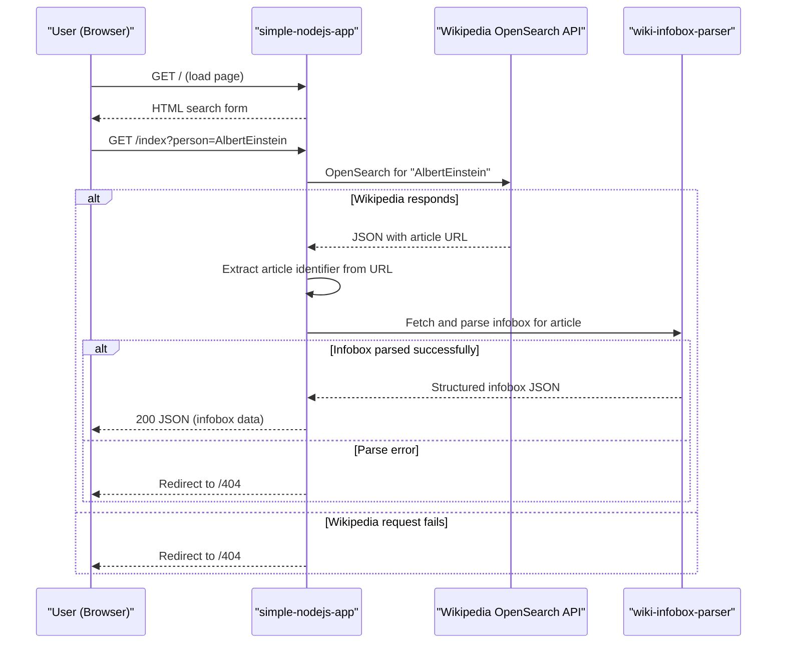

# Core Business Workflows

**simple-nodejs-app** allows users to research public figures by name — a user enters a person's name into a web form, and the application retrieves and displays the Wikipedia infobox data for that person.

## Domain Entities

| Entity | Service / Bounded Context | Description | Key Relationships |
|--------|--------------------------|-------------|------------------|
| PersonQuery | Search | A user's search request for a named individual | Drives a WikipediaSearch |
| WikipediaSearch | Search | An OpenSearch lookup against the Wikipedia API using the person's name | Resolves to a WikipediaArticle |
| WikipediaArticle | Content Retrieval | A Wikipedia article identified by URL, from which the infobox is extracted | Parsed into an InfoboxResult |
| InfoboxResult | Content Retrieval | The structured JSON data extracted from a Wikipedia article's infobox | Returned to the user as the API response |

## Service-to-Domain Mapping

| Service | Domain Context | Owned Entities | External Dependencies |
|---------|---------------|---------------|----------------------|
| simple-nodejs-app | Person Research | PersonQuery, WikipediaSearch, WikipediaArticle, InfoboxResult | Wikipedia OpenSearch API, wiki-infobox-parser |

This is a single-service application with no inter-service communication.

## Primary Workflows

### Workflow 1: Display Search Form

The user navigates to the application root (`/`). Express renders the `index.ejs` template, presenting an HTML form with a text input for the person's name and a submit button.

**Steps:**
1. Browser sends `GET /`
2. Express renders `index.ejs` and returns the HTML page
3. User sees the search form

No business rules or external calls are involved.

---

### Workflow 2: Person Research Lookup

The user submits the search form with a person's name. The application resolves the Wikipedia article URL for that person, fetches the infobox data, and returns it as JSON.

**Steps:**
1. Browser sends `GET /index?person={name}`
2. Application constructs a Wikipedia OpenSearch API URL with the `person` query parameter
3. Application calls the Wikipedia API via the `request` library
4. If the API call fails → redirect to `/404`
5. Application parses the JSON response and extracts the article URL (`result[3][0]`, trimming the first 30 characters of the URL)
6. Application passes the article identifier to `wiki-infobox-parser`
7. If infobox parsing fails → redirect to `/404`
8. Application returns the structured infobox JSON to the browser with `res.send(answers)`

## Cross-Service Data Flows

This application has no inter-service communication. All data flows are between the single Express process and the external Wikipedia API:

1. **Outbound: OpenSearch query** — the application sends the user's `person` string to Wikipedia's OpenSearch API and receives an array containing titles, descriptions, and article URLs.
2. **Outbound: Infobox parse** — the article URL is passed to `wiki-infobox-parser`, which internally fetches the Wikipedia article page and extracts the infobox as a structured JSON object.
3. **Fallback behavior**: if either external call fails (network error, malformed response, empty result), the user is redirected to `/404`. No partial results, retry, or degraded response is served.

## Business Workflow Sequence

## Business Rules & Decision Logic

**Validation Rules:**
- No formal input validation is applied to the `person` query parameter. Any string (including empty) is forwarded to the Wikipedia API.
- The application assumes `result[3][0]` in the Wikipedia OpenSearch response contains the article URL and slices from character index 30. If the URL format changes or the result set is empty, this will throw a runtime error rather than handling it gracefully.

**Decision Logic:**
- If either external call (Wikipedia or wiki-infobox-parser) returns an error, the user is unconditionally redirected to `/404`. No distinction is made between "person not found", "Wikipedia unreachable", and "parse error".

**State Transitions:**
- The application is stateless. Each request is independent; there is no session, user account, or persistent state.

**Error Handling:**
- Two error paths exist, both leading to the same outcome: redirect to `/404`. There is no error logging, no structured error response, and no user-facing error message beyond the 404 page.
- The `404.ejs` page hardcodes the message "404: Error not found" regardless of the actual error cause.

**Authorization:**
- No authorization or authentication is implemented. All endpoints are publicly accessible.

**Audit / Logging:**
- No audit trail or structured logging is in place. The only console output is the startup message `"Listening at port 3000..."`.
