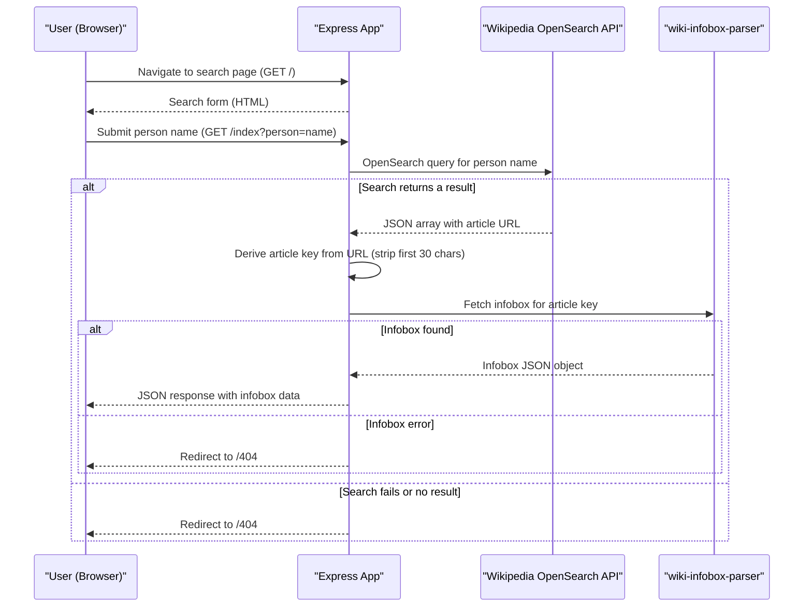

# Core Business Workflows

`simple-nodejs-app` is a single-purpose web application that allows users to search for a person by name and view their Wikipedia infobox data in JSON format.

## Domain Entities

| Entity | Service / Bounded Context | Description | Key Relationships |
|--------|--------------------------|-------------|------------------|
| Person Search | Search | A user-initiated query for a person by name | Triggers Wikipedia lookup |
| Wikipedia Article | External (Wikipedia) | A Wikipedia article identified by an article key derived from the OpenSearch result URL | Produced by OpenSearch, consumed by infobox lookup |
| Infobox Data | External (Wikipedia) | Structured key-value data from a Wikipedia article's infobox | Returned to browser as JSON |

## Service-to-Domain Mapping

| Service | Domain Context | Owned Entities | External Dependencies |
|---------|---------------|---------------|----------------------|
| simple-nodejs-app | Person Lookup | None (stateless) | Wikipedia OpenSearch API, wiki-infobox-parser |

## Primary Workflows

### Workflow 1: Search Home Page

The user navigates to the application root (`/`). The server renders the `index.ejs` template, which displays a text input and a search button. No external calls are made.

**Steps:**
1. Browser sends `GET /`
2. Express handler calls `res.render('index')`
3. EJS renders the search form HTML
4. Browser displays the form

### Workflow 2: Person Information Lookup

The user enters a person's name and submits the search form. The application queries the Wikipedia OpenSearch API to resolve the name to an article, then retrieves the article's infobox data, and returns it as JSON.

**Steps:**
1. Browser sends `GET /index?person=<name>`
2. Express handler constructs the Wikipedia OpenSearch URL with the `person` query parameter
3. `request` library sends HTTP GET to `https://en.wikipedia.org/w/api.php?action=opensearch&search=<name>&limit=1&namespace=0&format=json`
4. Wikipedia returns a JSON array; the handler extracts the article URL from `result[3][0]`
5. The article key is derived by stripping the first 30 characters of the URL
6. `wiki-infobox-parser` is called with the derived key
7. Wikipedia returns the infobox JSON for the article
8. The handler sends the parsed infobox JSON back to the browser
9. On any error at steps 3 or 6, the browser is redirected to `/404`

## Cross-Service Data Flows

There is a single linear data flow: Browser → Express App → Wikipedia OpenSearch API → wiki-infobox-parser → Browser. No service aggregation or composition is required. If any step in the Wikipedia call chain fails (network error, unexpected response structure, empty search result), the application redirects to `/404` without a meaningful error message or retry.

## Business Workflow Sequence

## Business Rules & Decision Logic

**Validation rules:**
- The `person` query parameter is not validated server-side. Any string (including empty) is forwarded to Wikipedia, and the result depends on Wikipedia's opensearch behaviour.

**Decision logic:**
- If the `request` callback returns an error → redirect to `/404`
- If `result[3][0]` is undefined (no Wikipedia article found) → runtime error / redirect to `/404`
- If `wiki-infobox-parser` callback returns an error → redirect to `/404`

**Data transformation:**
- The Wikipedia article key is derived by calling `.substring(30, x.length)` on the article URL, assuming the URL always starts with `https://en.wikipedia.org/wiki/`. This is a fragile assumption — URL structure changes or non-standard articles would silently produce incorrect keys.

**Error handling:**
- All errors result in a redirect to `/404`. No error details are logged or surfaced to the user. There is no distinction between "person not found", "Wikipedia unavailable", and "parse error".

**Transactions:** Not applicable — no database or stateful operations.

**Authorization:** None. All endpoints are publicly accessible.
