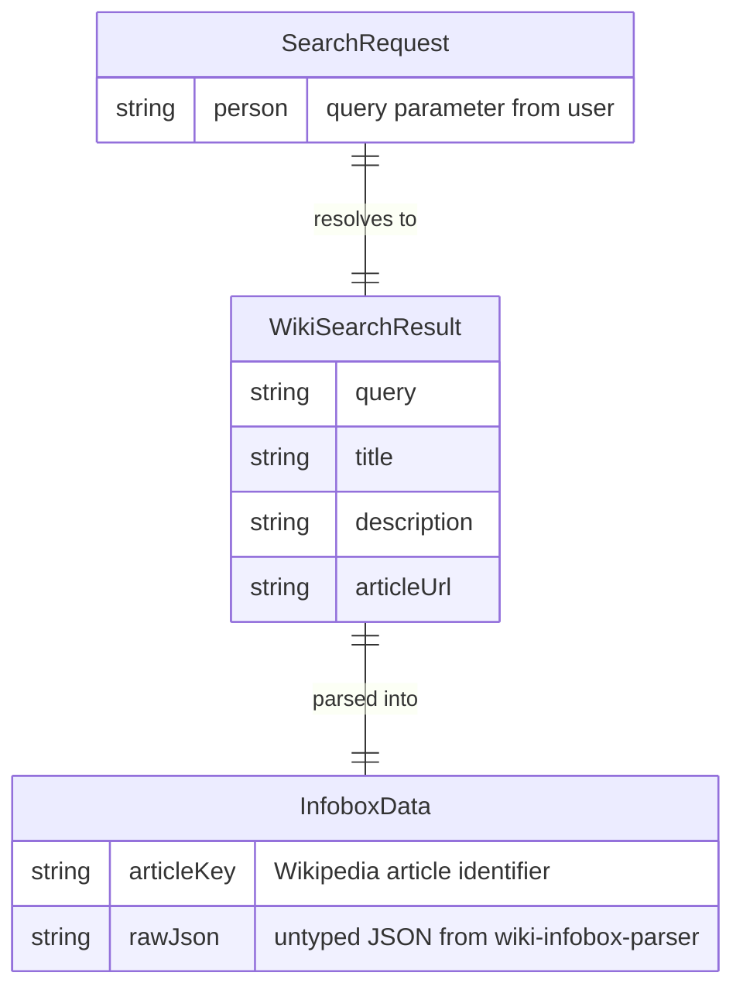

# Data Architecture & Persistence Layer

This application has **no local data layer**. There are no databases, ORM entities, or persistent storage of any kind — all data is fetched on demand from the external Wikipedia API.

## Database Configuration

| Service/Module | DB Type | Profile | Driver | Connection | Migration Tool |
|---------------|---------|---------|--------|-----------|---------------|
| simple-nodejs-app | None | N/A | None | None | None |

No database is configured or used. All data originates from external Wikipedia API calls at request time.

## Data Ownership per Service

| Service | Tables Owned | ORM Framework | Caching | Notes |
|---------|-------------|--------------|---------|-------|
| simple-nodejs-app | None | None | None | Stateless — no data stored locally |

## Entity Model

> Note: No persistent entities exist in this application. The diagram below represents the transient data shape returned by the Wikipedia API and passed through the application.

## Key Repository Methods

| Service | Repository | Notable Methods | Purpose |
|---------|-----------|----------------|---------|
| simple-nodejs-app | None | N/A | No repository layer; direct HTTP calls replace data access |

There is no repository or data-access abstraction. HTTP requests to the Wikipedia API are made inline in the Express route handler in `index.js`.

## Caching Strategy

No caching is implemented. Every request to `GET /index` results in two live outbound HTTP calls to Wikipedia:

1. The OpenSearch API call to resolve the article URL.
2. The wiki-infobox-parser call to fetch and parse the article infobox.

There is no in-memory cache, no Redis, no HTTP cache headers, and no request deduplication. Repeated searches for the same person will always hit Wikipedia. Adding a short-lived in-memory or Redis cache keyed by the `person` query parameter would be a straightforward performance improvement.

## Data Ownership Boundaries

As a stateless, single-service application, there are no cross-service data boundaries. The application owns no data — it acts purely as a proxy and transformer between the user's browser and the Wikipedia API.

**Read/write pattern**: Read-only. The application never writes data anywhere.

**Cross-service access**: The only external data source is the public Wikipedia API. Access is direct HTTP, not mediated by any service mesh, gateway, or broker.

### Data Classification & Sensitivity

| Entity | Sensitive Fields | Classification | Controls in Place |
|--------|-----------------|---------------|------------------|
| SearchRequest (`person` query param) | `person` (user-entered name) | PII (potential) | None — logged to console implicitly; no masking |
| WikiSearchResult / InfoboxData | Wikipedia public content | None | N/A |

The `person` query parameter is user-supplied input. While it typically contains a public figure's name, it could contain personally identifying search terms. No input sanitisation, logging controls, or data masking are in place. No data is persisted, so encryption-at-rest is not applicable.
