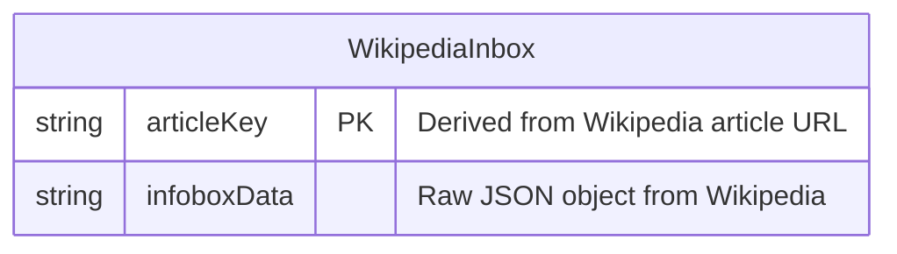

# Data Architecture & Persistence Layer

The application has no local persistence layer — it operates as a stateless proxy to the Wikipedia API, with no database, ORM, or local data storage of any kind.

## Database Configuration

| Service/Module | DB Type | Profile | Driver | Connection | Migration Tool |
|----------------|---------|---------|--------|-----------|----------------|
| simple-nodejs-app | None | N/A | N/A | N/A | None |

No database is configured. All data is retrieved on-demand from the Wikipedia external API and is not stored locally.

## Data Ownership per Service

| Service | Tables Owned | ORM Framework | Caching | Notes |
|---------|-------------|---------------|---------|-------|
| simple-nodejs-app | None | None | None | Purely stateless; no local data ownership |

## Entity Model

> Note: No local entities, ORM models, or database schemas are defined in this project. The application consumes and forwards external API data without persisting it.

The only data structure in use is the transient Wikipedia infobox JSON object, received from the external `wiki-infobox-parser` library on each request and forwarded directly to the HTTP client without storage.

## Key Repository Methods

| Service | Repository | Notable Methods | Purpose |
|---------|-----------|----------------|---------|
| simple-nodejs-app | None | N/A | No data access layer present |

## Caching Strategy

No caching is implemented. Every request to `/index?person=...` triggers two fresh outbound HTTP calls to the Wikipedia API. There is no in-memory cache, Redis, or HTTP response cache configured. This means repeated lookups for the same person incur full round-trip latency every time.

## Data Ownership Boundaries

The application does not own any data. It acts as a thin proxy: the client submits a search term, the server relays it to Wikipedia, and the raw result is returned to the client. There is no shared or isolated database, no multi-service topology, and no CQRS or read/write separation.

### Data Classification & Sensitivity

| Entity | Sensitive Fields | Classification | Controls in Place |
|--------|-----------------|----------------|-------------------|
| Query parameter `person` | Person name (user input) | Potential PII | None — transmitted in URL query string unencrypted |

The `person` query parameter is a person's name submitted by the user. It is sent over plain HTTP (no TLS configured), appears in server access logs, and is forwarded to Wikipedia's public API. No encryption-at-rest, masking, or access controls are applied. While no PII is stored, the lack of HTTPS means the search term is transmitted in cleartext.
