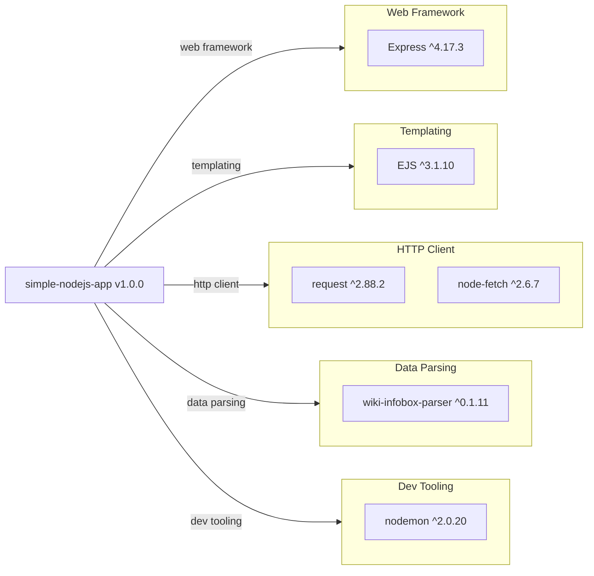

# Dependency Map

`simple-nodejs-app` declares 6 runtime dependencies in `package.json`. There are no dedicated test dependencies configured.

## Dependencies

### Dependency Summary

| Category | Count | Key Libraries | Notes |
|----------|-------|--------------|-------|
| Web Framework | 1 | Express ^4.17.3 | Stable; Express 5 now available |
| Templating | 1 | EJS ^3.1.10 | Current; EJS 6 is a major upgrade |
| HTTP Client | 2 | request ^2.88.2, node-fetch ^2.6.7 | `request` is deprecated (archived 2020); `node-fetch` v2 still active but v3 is ESM-only |
| Data Parsing | 1 | wiki-infobox-parser ^0.1.11 | Low-activity package; no major updates |
| Dev Tooling | 1 | nodemon ^2.0.20 | nodemon 3 available |

### Version & Compatibility Risks

The most significant risk is the `request` library (^2.88.2), which has been formally deprecated and archived since 2020 — it receives no security patches. `node-fetch` ^2.6.7 is the v2 branch (CommonJS); v3 is ESM-only and requires Node.js ESM setup, making migration non-trivial. Express ^4.17.3 is several minor versions behind the current 4.x stream (4.21+) and Express 5 introduced breaking changes. `nodemon` ^2.0.20 is behind version 3; while not a runtime risk, it is a development dependency that is out of date. `ejs` ^3.1.10 remains current in the 3.x line, though EJS 6 represents a major-version jump flagged by `npm-check-updates`.

### Notable Observations

- **Duplicate HTTP client concern**: Both `request` (deprecated) and `node-fetch` are declared, but only `request` is imported in `index.js`. `node-fetch` is unused dead code.
- **No test framework**: There are zero test-scoped dependencies. The `test` script simply exits with an error, meaning there is no automated test coverage.
- **Deprecated core dependency**: `request` is a security risk for a production application — it is no longer receiving vulnerability patches.
- **Single entry-point architecture**: All dependencies flow through one file (`index.js`), meaning there is no modular structure to partially upgrade.

## Test Dependencies

No test-scoped dependencies detected.

Total test-scope dependencies: 0

The project has no test framework configured. The `package.json` `test` script is a stub that exits with code 1. Adding a test framework (e.g., Jest or Mocha) is recommended before modernisation to establish a regression baseline.
