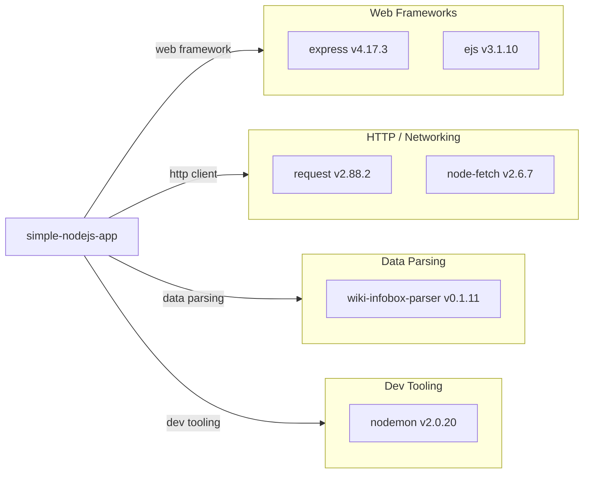

# Dependency Map

This document maps all external dependencies of **simple-nodejs-app**, a Node.js/Express web application. The project declares **6 direct production dependencies** and no test dependencies.

## Dependencies

### Dependency Summary

| Category | Count | Key Libraries | Notes |
|----------|-------|--------------|-------|
| Web Frameworks | 2 | express v4.17.3, ejs v3.1.10 | Express v4 is in maintenance; v5 is stable |
| HTTP / Networking | 2 | request v2.88.2, node-fetch v2.6.7 | Both are outdated; `request` is deprecated |
| Data Parsing | 1 | wiki-infobox-parser v0.1.11 | Low activity upstream; version 0.x signals pre-stability |
| Dev Tooling | 1 | nodemon v2.0.20 | v3 is current; should be `devDependencies` |

### Version & Compatibility Risks

The most significant risk is the **`request` package (v2.88.2)**, which has been officially deprecated since February 2020 and receives no security updates. It should be replaced with a maintained alternative such as `node-fetch` (already present) or `undici`. `node-fetch` v2.6.7 is also outdated — v3 is the current stable release but requires ESM syntax, which necessitates adding `"type": "module"` to `package.json` or using dynamic imports. `express` v4.17.3 is an older patch of the v4 line; Express v5 is now stable and available. `nodemon` v2.0.20 is two major versions behind (v3 is current) and is incorrectly listed under `dependencies` instead of `devDependencies`, meaning it is bundled in production installs unnecessarily.

### Notable Observations

- **`request` is deprecated**: The package has been in maintenance-only mode since 2020 with no active development. Its use introduces supply-chain risk and it should be replaced.
- **Duplicate HTTP client libraries**: Both `request` and `node-fetch` are declared, but only `request` is used in `index.js`. `node-fetch` appears unused and adds unnecessary weight.
- **`nodemon` in production dependencies**: Development-only tooling should be declared under `devDependencies` to avoid being included in production installs.
- **`wiki-infobox-parser` is a 0.x package**: The pre-1.0 version signals an unstable public API; upgrades could introduce breaking changes.

## Test Dependencies

No test dependencies detected.

Total test-scope dependencies: **0**

No testing framework (e.g., Jest, Mocha, Jasmine) is configured in `package.json`. The default `npm test` script returns an error. Adding a test framework and writing unit/integration tests is recommended before any migration work.
